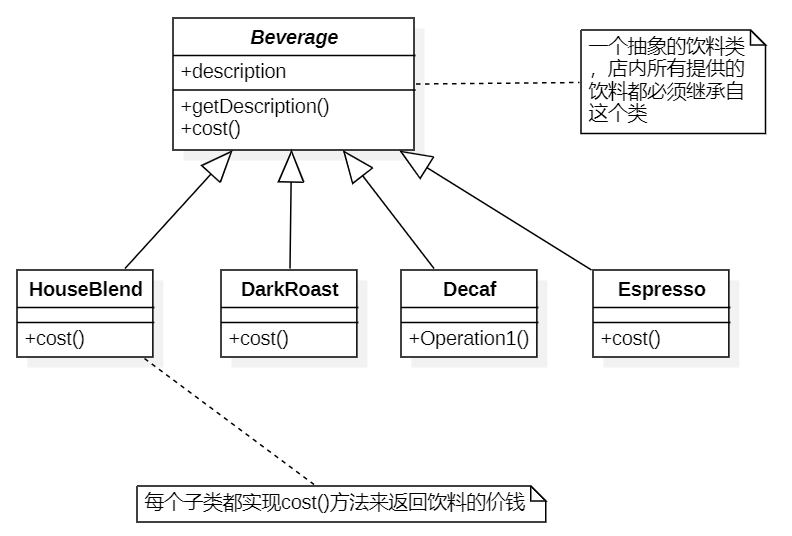
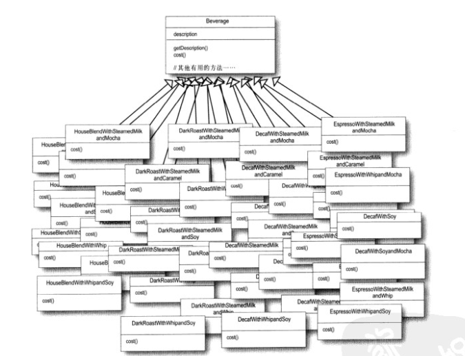
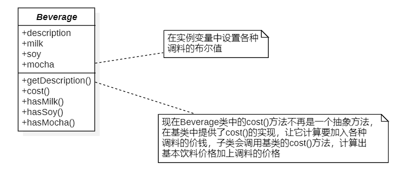
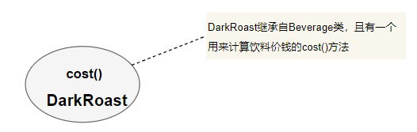
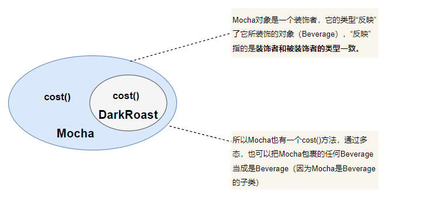
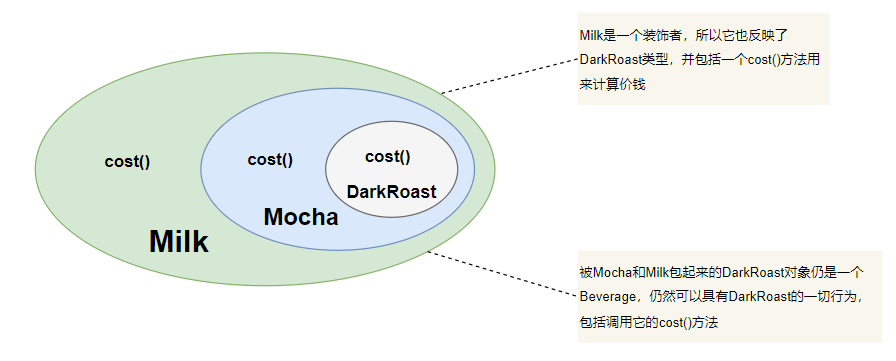
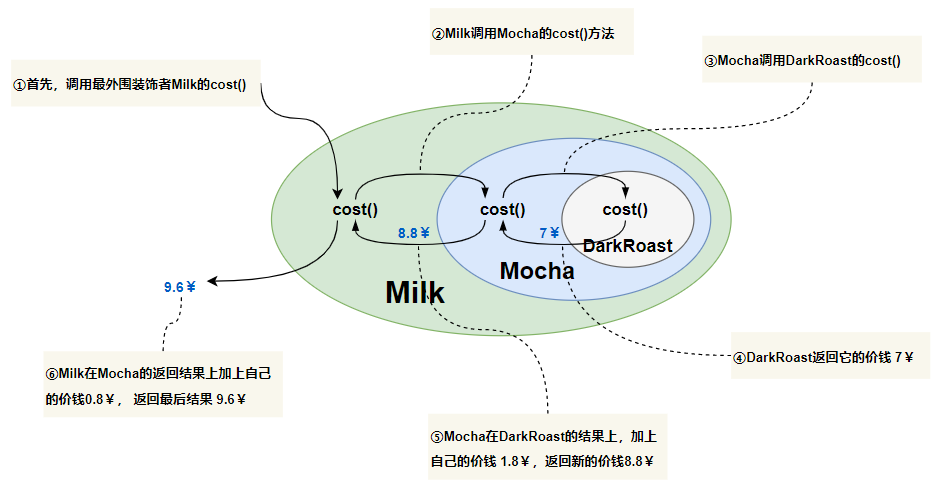
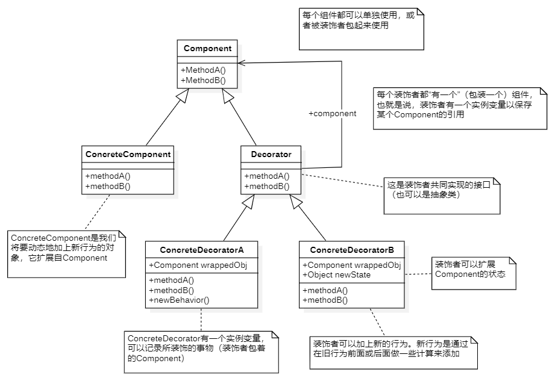
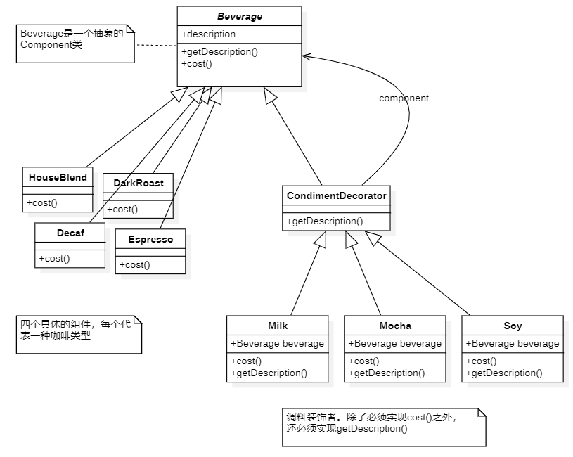

# 装饰者模式

## 设计场景

考虑一家咖啡店的饮料供应，最初的类设计如下图



人在购买咖啡时，也可以要求在其中加入各种调料，例如：牛奶（Milk）、豆浆（Soy）、摩卡（Mocha）等，咖啡店会根据所加入的调料收取不同的费用

**最初解决方案（全部使用继承）：**



**存在问题：**

> 所有的咖啡都通过继承饮料类，导致“类爆炸”现象的发生！
>
> 很明显，这样的做法很难以维护，如果牛奶的价格上涨，需要修改所有加入牛奶了的咖啡。如果要新增一种焦糖调料的咖啡时，需要新增一个类，继承Beverage类


**下一种方案（利用实例变量和继承）：**

在Beverage基类中加入各种实例变量代表是否加上调料（牛奶、豆浆、摩卡...）



基类的`cost()`方法将计算所有调料的价钱，而子类覆盖过的`cost()`方法会扩展超类的功能，把指定的饮料类型的价钱也加进来

每个`cost()`方法需要计算该饮料的价钱，然后调用基类的`cost()`实现，加入调料的价钱

**存在问题：**

>1. 调料价钱改变时，就需要修改基类中的cost()方法的代码
>2. 一旦出现新的调料，就需要在基类中加上新的方法，并修改基类中的cost()方法
>3. 以后可能会开发出新的饮料，而对新开发的饮料而言，某些调料肯可能并不适用，但在这个设计中，子类会继承所有不适用的方法
>4. cost()方法中价钱的计算都写死了，一旦出现顾客想要添加双倍的摩卡的咖啡，是新加一个双倍摩卡咖啡的类，还是修改cost()方法？


**设计原则：**

<font color="blue" size="7">**类应该对扩展开放，对修改关闭**</font>

设计出来的类应该容易扩展，在不修改现有代码的情况下，就可搭配新的行为。这样的设计具有弹性可以应对改变，可以接受新的功能来应对改变的需求。

这种设计的关键是要把注意力集中在设计中最有可能改变的地方，然后应用开放-关闭原则。

## 装饰者初探

继承无法完全解决问题，使用继承存在的问题：

​		类数量爆炸、设计死板、基类加入的新功能并不适用于所有的子类

解决办法：以饮料（`Beverage`）类为主题，运行时用调料来“装饰”饮料。

例：顾客想要**摩卡和牛奶深焙咖啡**

1. 拿一个深焙咖啡（`DarkRoast`）对象
2. 用摩卡（`Mocha`）对象装饰它
3. 用牛奶（`Milk`）对象装饰它
4. 调用cost()方法，并依赖委托（delegate）将调料的价格加上去

问题：如何“装饰”一个对象？“委托”如何与装饰搭配使用？

1. 从`DarkRoast`对象开始

   

2. 建立一个`Mocha`对象，并用它将`DarkRoast`对象包起来，`Mocha`也继承自`Beverage`，所以也有一个`cost()`方法

   

3. 建立一个`Milk`装饰者，并用它将`Mocha`对象包起来。

   

4. 通过调用最外层的装饰者（Milk）的cost()就可以计算其总价钱。Milk的cost()会先委托它的装饰对象（Mocha）计算出价钱，然后再加上自己的价钱。

   

## 定义装饰者

**<font color="red" size=7>装饰者模式动态地将责任附加到对象上。若要扩展功能，装饰者提供了比继承更有弹性的替代方案</font>**

> - **装饰者和被装饰对象有相同的超类型**
> - 可以用一个或多个装饰者包装一个对象
> - 因为装饰者和被装饰者有相同的超类型，所以在任何需要被包装的对象（DarkRoast）的场合，可以用装饰过的对象（Milk）代替它
> - **装饰者可以在所委托被装饰者的行为之前与/或之后，加上自己的行为，以达到特定的目的**
> - 对象可以在任务时候被装饰，可以在运行时，动态地、不限量地使用其他的装饰者来装饰对象



使用装饰者模式装饰饮料对象：



- 继承和组合的联合使用，在装饰者模式中使用了继承和组合，这里的使用**继承的目的是为了达到“类型匹配**” -> 因为装饰者必须能取代被装饰者，而不是利用继承获得“行为”
- 当将**装饰者与组件组合时，就是在加入新的行为**。所得到的新行为，并不是继承自超类，而是由组合对象得来的。
- 如果依赖继承，那么类的行为只能在编译时静态决定，而利用组合，可以把装饰者在”运行时“混合着用
- 在任何时候，只要实现新的装饰者就可以增加新的行为。如果以来继承，每当需要新行为时，还要修改现有的代码

## 代码实现

**Beverage饮料抽象类：**

`Beverage`是一个抽象类，有两个方法：`getDescription()`、`cost()`

```Java
public abstract class Beverage {
    String description = "Unknown Beverage";

    //getDescription()已经实现了，但是cost()必须在子类中实现
    public String getDescription(){
        return this.description;
    }

    public abstract double cost();
}
```

**Condiment调料抽象类：**

要让`CondimentDecorator`类能够取代Beverage，所以将`CondimentDecorator`继承自Beverage类

```Java
public abstract class CondimentDecorator extends Beverage{
    public abstract String getDescription();
}
```

**饮料的具体类**

浓缩咖啡Espresso：

```Java
public class Espresso extends Beverage {

    /*
        写一个构造器，用来设置饮料的描述
        description变量继承自Beverage
     */
    public Espresso(){
        super.description = "Espresso";
    }

    /*
        计算Espresso 的价格，不需要管调料的价钱，
        直接返回Espress咖啡的价钱 ￥ 7.99 即可
     */
    @Override
    public double cost() {
        return 7.99;
    }
}
```

经典混合咖啡咖啡：

```Java
public class HouseBlend extends Beverage {

    public Nescafe(){
        super.description = "HouseBlend";
    }
    
    /*
        另一种饮料，做法和Espresso一样
        只是把名称改为 HouseBlend，并返回正确的价钱 ￥6.89
     */
    @Override
    public double cost() {
        return 6.89;
    }
}
```

深度烘焙咖啡：

```Java
public class DarkRoast extends Beverage {
    public DarkRoast(){
        super.description = "DarkRoast";
    }

    @Override
    public double cost() {
        return 6.3;
    }
}
```

脱因咖啡：

```Java
public class Decaf extends Beverage {
    public Decaf(){
        super.description = "Decaf";
    }

    @Override
    public double cost() {
        return 9.99;
    }
}
```

**调料的具体类：**

摩卡`Mocha`类：

Mocha类是一个装饰者，所以它继承自`CondimentDecorator`

要让Mocha能够对Beverage进行装饰：

1. 用一个实例变量记录被装饰者Beverage，
2. 把Beverage当做构造函数的参数，再由构造函数将Beverage记录到实例变量中

```Java
public class Mocha extends CondimentDecorator {

    Beverage beverage;

    public Mocha(Beverage beverage){
        this.beverage = beverage;
    }
    @Override
    public double cost() {
        /*
            要计算Mocha饮料的价钱，首先把调用委托给被装饰对象，以计算价格
            然后再加上Mocha的价钱，得到最后的价钱
         */
        return 1.2 + beverage.cost();
    }

    @Override
    public String getDescription() {
        /*
            描述的不仅是饮料，而是完整地连调料都描述出来
         */
        return beverage.getDescription() + ", Mocha";
    }
}
```

牛奶调料`Milk` 类：

```Java
public class Milk extends CondimentDecorator {

    Beverage beverage;

    public Milk(Beverage beverage){
        this.beverage = beverage;
    }

    @Override
    public double cost() {
        return 2.5 + beverage.cost();
    }

    @Override
    public String getDescription() {
        return beverage.getDescription() + " , Milk";
    }
}
```

豆豆浆调料Soy类：

```Java
public class Soy extends CondimentDecorator {
    Beverage beverage;

    public Soy(Beverage beverage){
        this.beverage = beverage;
    }
    @Override
    public double cost() {
        return 1.2 + beverage.cost();
    }

    @Override
    public String getDescription() {
        return beverage.getDescription() + ", Soy";
    }
}
```

**测试类：**

```Java
public class Main {
    public static void main(String[] args) {
        //点一杯DarkRoast咖啡,不要任何调料，打印出它的描述与价钱
        Beverage beverage = new DarkRoast();
        System.out.println(beverage.getDescription() + "￥" + beverage.cost());

        /*
            DarkRoast￥6.3
         */

        //点一杯调料为Mocha 和 Milk 的 Decaf咖啡
        Beverage beverage2 = new Decaf();
        //用Mocha装饰它
        beverage2 = new Mocha(beverage2);
        //用Milk装饰它
        beverage2 = new Milk(beverage2);
        System.out.println(beverage2.getDescription() + "￥" + beverage2.cost());
        
        /*
            Decaf, Mocha , Milk￥13.69
         */

        //点一杯调料为Soy、Mocha 和 Milk的 HouseBlend咖啡
        Beverage beverage3 = new HouseBlend();
        //用Soy装饰它
        beverage3 = new Soy(beverage3);
        // 用Mocha装饰它
        beverage3 = new Mocha(beverage3);
        //用Milk装饰它
        beverage3 = new Milk(beverage3);
        System.out.println(beverage3.getDescription() + "￥" + beverage3.cost());
        
        /*
            HouseBlend, Soy, Mocha , Milk￥11.79
         */
    }
}
```


> 1. 继承属于扩展行为的方式之一，但不见得是达到弹性设计的最佳方式。
> 2. 用该允许行为可以被扩展，而不需要修改现有的代码。
> 3. 组织和委托可用于在运行时动态地加上新的行为。
> 4. 装饰者模式意味着有一群装饰者类，这些类用来包装具体的组件。
> 5. 装饰者和被装饰者都具有相同的类型，它们都经过接口或继承实现。
> 6. 装饰者可以在被装饰者的行为前面/或后面加上自己的行为，甚至将被装饰者的行为整个取代掉，从而达到特定的目的。
> 7. 可以用无数个装饰者包装一个组件。
> 8. 装饰者可能会导致设计中出现许多的小对象，如果过渡使用，会让程序变得很复杂。


