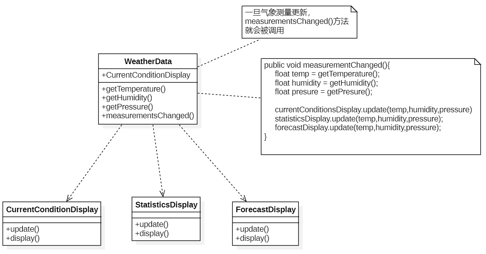
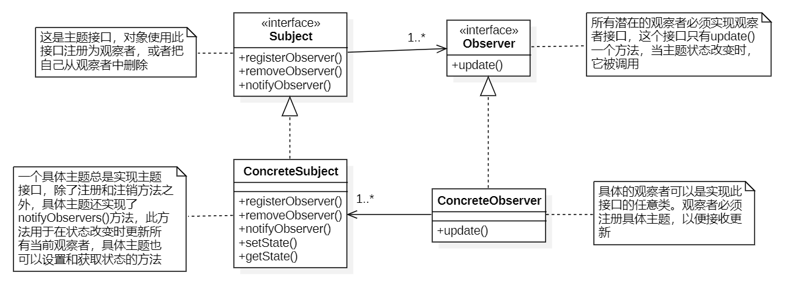
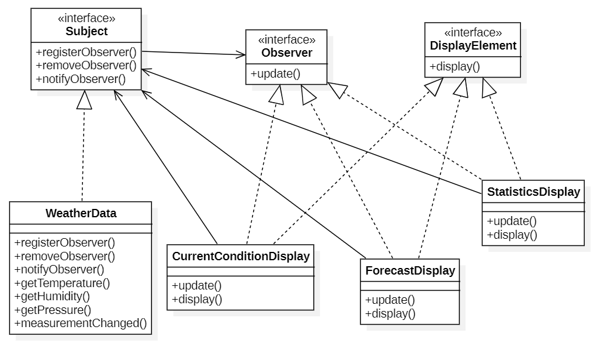
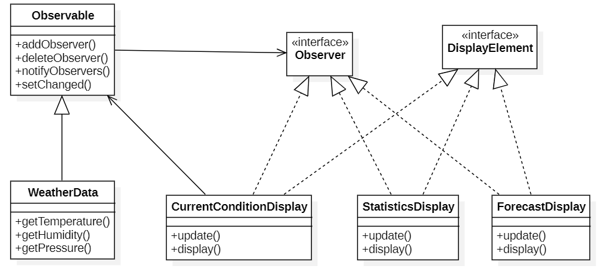

# 观察者（Observer）模式

## 设计场景

考虑设计一个气象站系统。此系统中的三个部分是气象站（获取实际气象数据的物理装置）、`WeatherData`对象（追踪来自气象站的数据，并更新布告）和布告板（显示目前天气状况给用户）

`WeatherData`对象知道如何跟物理气象站联系，以取得更新的数据。`WeatherData`会随即更新三个布告板的显示：目前状况（温度、湿度、气压）、气象统计和天气预报

我们的工作就是建立一个应用，利用`WeatherData`对象取得数据，并更新三个布告板：目前状况，气象统计和天气预报

## 最初的设计



在上面的类图的设计中的缺点

1. 调用三个布告板的方法，这是针对具体实现编程，会导致以后在增加或删除布告板时必须修改程序。
2. 对于改变的地方需要封装起来。
3. 在`measurementChanged()`方法中调用不同布告板的update()方法看起来像是一个统一的接口，布告板的方法名称都是`update()`，参数都是温度、湿度、气压。

## 观察者模式

下面先看一个报纸和杂质订阅之间的关系

1. 报社的业务就是出版报纸
2. 向某家报社订阅报纸，只要他们有新的报纸出版，就会给订阅用户送来，只要是报社的订阅用户，**就会一直收到新报纸**
3. 当订阅用户不想看报纸的时候，取消订阅，报社就不会再送新的报纸来
4. 只要报社还在运营，就会一直有人（或单位）向报社订阅报纸或取消订阅报纸

在上面这个例子中，出版社就是“主题”（Subject），订阅者就是”观察者“（observer）

**观察者模式：**

<font color="red" size="5">**观察者模式定义了对象之间的一对多依赖，这样一来，当一个主题对象改变状态时，它的所有依赖者都会收到通知并自动更新。**</font>

主题和观察者定义了一对多的关系。观察者依赖于此主题，只要主题状态一有变化，观察者就会被通知。根据通知的风格，观察者可能因此新值而更新。



- 利用观察者模式，主题是具有状态的对象，并且可以控制这些状态。
- 观察者模式提供了一种对象设计，**让主题和观察者之间松耦合。**
- 关于观察者的一切，主题只知道观察者实现了某个接口（Observer接口）任何时候我们都可以添加新的观察者。因为**主题唯一依赖的东西是一个实现Observer接口的对象列表**，所以我们可以随时增加观察者，同样也可以随时删除某些观察者。
- 有新类型的观察者出现时，主题的代码不需要修改，我们需要做的就是在新的类里实现Observer接口，然后注册为观察者。主题不在乎别的，它只会发送通知给所有注册成为了观察者的对象。
- 改变主题或观察者其中一方，并不会影响另一方，**因为两者是松耦合的**，只要它们之间的接口仍被遵守，我们就可以自由地改变他们

**设计原则：**

<font size="5" color="dodgerblue">**为了交互对象之间的松耦合设计而努力**</font>

## 设计气象站



所有的气象布告板都实现观察者接口。这样主题在需要通知观察者时，有了一个共同的接口。

同时，也为所有的布告板建立一个共同的接口（`DisplayElement`），布告板只需要实现display()方法。

## 气象站的实现

**主题(Subject)接口：**

```java 
public interface Subject {
    public void registerObserver(Observer o);
    public void removeObserver(Observer o);

    //当气象观测值改变时，主题会把这些状态当做参数，传递给观察者
    public void notifyObserver();
}
```

**观察者(Observer)接口:**

```java 
public interface Observer {
    //当气象观测值改变时，主题会把这些状态值当做方法的参数，传送给观察者
    public void update(float temp, float humidity, float pressure);
}
```

**DisplayElement接口：**

```Java
public interface DisplayElement {
    //布告板需要显示信息时，调用这个方法
    public void display();
}
```

**WeatherData类：**

```java
public class WeatherData implements Subject{

    //这个ArrayList用来记录观察者，这个ArrayList在构造方法中建立
    //当注册观察者时，只需要把它加到ArrayList中即可
    private ArrayList<Observer> observers;
    private float temperature;
    private float humidity;
    private float pressure;

    public WeatherData(){
        observers = new ArrayList<>();
    }

    @Override
    public void registerObserver(Observer o) {
        observers.add(o);
    }

    @Override
    public void removeObserver(Observer o) {
        observers.remove(o);
    }

    //遍历这个ArrayList，把状态告诉每一个观察者
    @Override
    public void notifyObserver() {
        for(Observer ob : observers){
            ob.update(temperature,humidity,pressure);
        }
    }

    public void measurementsChanges(){
        notifyObserver();
    }

    public void setMeasurements(float temperature, float humidity, float pressure){
        this.temperature = temperature;
        this.humidity = humidity;
        this.pressure = pressure;
        
        //每次设置好温度湿度和压强的时候，都触发改变
        measurementsChanges();
    }
}
```

**CurrentConditionDisplay布告板类：**

```java
public class CurrentConditionDisplay implements DisplayElement,Observer {
    private float temperature;
    private float humudity;

    private float pressure;

    private Subject weatherData;

    //向构造方法中传入一个WeatherData对象，作为注册使用
    public CurrentConditionDisplay(Subject weatherData){
        this.weatherData = weatherData;
        weatherData.registerObserver(this);
    }

    @Override
    public void display() {
        System.out.println("Current conditions:"+temperature+"F degrees and "+ humudity +
                "% humidity" + "pressure:"+pressure);
    }

    @Override
    public void update(float temp, float humidity, float pressure) {
        this.temperature = temp;
        this.humudity = humidity;
        this.pressure = pressure;
        display();
    }
}
```

## push和pull的方式

在上面的实现中主题每次的状态改变，都会主动通知所有实现了`Observer`接口的观察者，这是一种“push”的方式，即不管观察者需要什么信息都会将所有的数据都发送给所有的观察者。

但观察者种类会有很多，不同的观察者的需求可能会有所不同。如果某个观察者只是需要一点点数据，采用“push”的方式，就会强迫收到一堆数据。

另一种实现方式是采用“pull”的方式，主题，可以提供一些公开的getter方法，让观察者根据的需要“拉”走主题的状态。

但是“pull”也有缺点就是，观察者可能需要调用很多次才能收集全它所需要的状态数据。此外这样也意味着主题需要门户大开，让所有观察者能够进来大肆挖掘各种数据，这是很危险的。

## Java内置的观察者模式

在Java API有内置的观察者模式。

`java.util`包（package）内包含最基本的`Observer`接口与`Observer`类，这和我们的`Subject`接口与`Observer`接口很相似。

`Observer`接口与`Observable`类使用上更方便，因为许多功能都已经事先准备好了，可以使用“push”或“pull”的方式传送数据。

**更新后的类图：**



`Observable`类追踪所有的观察者，并通知它们。

`Observable`是一个类，而不是一个接口，所以`WeatherData`扩展了`Observable`主题，所以注册、删除、通知观察者的方法不需要在`WeatherData`具体的主题中定义了，因为已经从父类中继承了这些行为。

**运作方式：**

**成为观察者：**

和之前的实现方式一样，观察者实现观察者接口（`java.util.Observer`），然后调用`Observable`对象的`addObserver()`方法，不想再当观察者时，调用`deleteObserver()`方法就可以了

**可观察者发送出通知**

首先，需要利用扩展java.util.Observable类产生“可观察者”类，然后，需要两个步骤：

1. 先调用`setChanged()`方法，标记状态已经改变的事实

2. 调用两种`notifyObservers()`方法中的一个

   ```java 
   //第一种
   notifyObservers()
   ```

   ```java
   //第二种
   notifyObservers(Object arg)  //通过这个参数，可以传送任何的数据对象给每一个观察者
   ```

**观察者接收通知：**

和之前的实现一样，观察者实现了`update()`方法，但是方法签名不太一样：

```java 
update(Observable o, Object arg)
```

主题本身当做第一个参数，让观察者知道是哪个主题通知它

第二个参数是传入`notifyObservers(arg)`的数据对象。如果没有说明为空

如果想使用”push“的方式，可以把数据当做数据对象传送给`notifyObservers(arg)`方法。否则，观察者就必须从可观察者对象中”pull“数据。

**setChanged()方法的作用：**

`setChanged()`方法用来标记状态已经改变的事实，好让`notifyObservers()`知道当它被调用时，应该更新观察者，如果调用`notifyObservers()`之前没有先调用`setChanged()`观察者就不会被通知。

```java
//伪代码
setChanged(){
    changed = true
}

notifyObservers(Object arg){
    if(changed){  //notifyObservers()只会在changed标位true的时候通知观察者
        for every observers in the list{
            call update(this,arg)
        }
        changed = false  //在通知完之后，把changed标志标回false
    }
}

notifyObservers(){
    notifyObservers(null)
}
```

`setChanged()`方法让我们在更新观察者时，有更多弹性，可以**<font color="red">适当地</font>**通知观察者。

如果没有`setChanged()`方法，气象站的测量就会非常敏锐，以至于温度计度数每十分之一度的改变都会更新，这就导致`WeatherData`对象持续不断地通知观察者。

## 使用Java内置观察者模式

现在`WeatherData`不需要再追踪观察者了，也不需要管理注册和删除（让父类代劳）

现在构造方法也不再需要为了记住观察者们而建立数据结构

这里考虑使用“pull”的方式

**WeatherData类：**

```Java
import java.util.Observable;

public class WeatherData extends Observable {  //这里继承了Observable类
    private float temperature;
    private float humidity;
    private float pressure;

    public void measurementChanged(){
        super.setChanged();
        //使用“pull"的方式，所以在通知观察者的时候没有传递数据对象
        super.notifyObservers();
    }

    public void setMeasurements(float temperature, float humidity, float pressure){
        this.temperature = temperature;
        this.humidity = humidity;
        this.pressure = pressure;
        measurementChanged();
    }

    //观察者们可以通过下面的getter方法根据它们的需求拉到它们想要的数据
    public float getTemperature(){
        return this.temperature;
    }

    public float getHumidity() {
        return this.humidity;
    }

    public float getPressure(){
        return this.pressure;
    }
}
```

**CurrentConditionDisplay布告板类：**

1. 需要实现`java.util.Observer`接口
2. 现在构造方法需要一个`Observable`当参数，并将当前对象登记为观察者
3. 修改`update()`方法，增加`Observable`和数据对象作为参数。在`update()`方法中，先确定可观察者属于`WeatherData`类型，然后利用getter方法采用“pull”的方式，拉去到温度和湿度测量值。

```Java
import java.util.Observable;
import java.util.Observer;

public class CurrentConditionDisplay implements Observer, DisplayElement {
    Observable observable;
    private float temperature;
    private float humidity;

    @Override
    public void display() {
        System.out.println("Current conditions:" + temperature + "F degrees and"+humidity);
    }

    @Override
    public void update(Observable o, Object arg) {
        if(o instanceof WeatherData){
            WeatherData weatherData = (WeatherData) o;
            this.temperature = weatherData.getTemperature();
            this.humidity = weatherData.getHumidity();
            display();
        }
    }
}
```

## 使用Java内置观察者模式的缺点

在Java的内置的API中，`Observable`是一个类，而不是一个接口。所以就必须设计一个类来继承它，这样做的不好之处就是，如果某一个类想要同时具有Observable和另一个超类的行为，就会陷入两难，因为Java是不支持多重继承的。这限制了Observable的复用能力。

其次，因为没有Observable接口，所以无法建立自己的实现，在Observable类中，`setChanged()`方法被定义为`protected`，这意味着：除非继承自Observable，否则无法创建Observable实例并组合到自己的对象中来。

这个设定违反了“多用组合，少用继承”的设计原则。

> 要点总结：
>
> 1. 观察者模式定义了对象之间的一对多的关系。主题（可观察者）用一个共同的接口来更新观察者。
> 2. 观察者和可观察者之间用松耦合的方式结合，可观察者不知道观察者的细节，只知道观察者实现了观察者接口。
> 3. 使用观察者模式，可以从被观察者处推“push”或拉“pull”数据。（push的方式被认为更“正确”）。
> 4. 有多个观察者时，不可以依赖特定的通知次序。
> 5. Java有多重观察者模式的实现，包括了通用的java.util.Observable，但要注意java.util.Observable实现上所带来的一些问题，如果有必要的话，可以实现自己的Observable。

