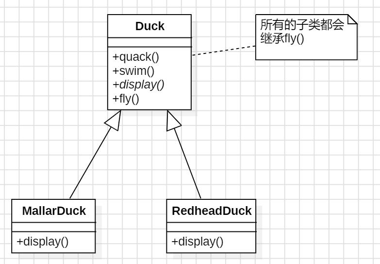

# 策略模式

## 1.直接使用继承

下面考虑这样一个任务场景：

一个模拟鸭子的游戏SimDuck。游戏中会出现各种鸭子，一边游泳，一边呱呱叫。

最初的设计：


下面如果需要让鸭子具有飞的行为，按照上面的设计，就需要再父类Duck中添加fly()方法



但是这样存在一个严重的问题：并非所有的子类都会飞。这样会导致某些并不适合这个行为的子类也会具有这个行为。

在父类中直接加上fly()方法，会导致所有的子类都具备fly的行为，连那些不该具备fly()的子类也无法免除

## 2.考虑使用接口

可以把fly()从超类中取出来，放进一个Flyable接口中，这样以来，只有会飞的鸭子才实现这个接口。同样的方式，也可以用来设计一个Quackable接口，因为并不是所有的鸭子都会叫


使用这两个接口似乎一开始很不错，解决了问题（只有会飞的鸭子才继承Flyable），但是Java接口布局别又实现代码，所以继承接口无法达到代码的复用。这意味着：**无论什么时候需要修改某个行为，必须往下追踪并在每个定义这个行为的类中修改它。**

**设计原则：**

**<font  size="5"  color="red" >找出应用中可能需要变化的地方，把它们独立出来，不要和那些不需要变化的代码混在一起</font>**

把会变化的部分取出来并封装起来，以便以后可以轻易地改动或扩充次部分，而不影响不需要变化的其他部分（系统中的某部分改变不会影响其他部分）

所以需要把鸭子的行为从Duck类中取出来了！

## 3.分开变化和不会变化的部分

除了fly()和quack()的问题之外，Duck类似乎没有特别需要经常变化或修改的地方。

心爱你在为了要分开**“变化和不会变化的部分”**，准备再建立两组类（完全原理Duck类），一个是“fly()” 相关的，一个是“quack()"相关的，每一组类将实现各自的动作。

**<font size="5" color="DodgerBlue">Duck类内的fly()和quack()会随着鸭子的不同而改变</font>**

<font size = "5" color="DodgerBlue">**为了要把这这两个行为从Duck类中分开，要将它们从Duck类中取出来，建立一组新类来代表每个行为**</font>

## 4.设计鸭子的行为

我们希望一切是能有弹性的，还想能够“**指定”鸭子的行为到鸭子的实例**。比如说，如果要产生一个新的绿头鸭实例，能够指定特定“类型”的飞行行为给它

换句话说，应该在鸭子类中包含设定行为的方法，这样可以在”运行时“动态地”改变“ 绿头鸭的飞行行为

**设计原则：**

**<font  size="5"  color="red" >面向接口编程，而不是面向具体的实现编程</font>**

“针对接口编程”关键就在于多态。利用多态，程序可以针对超类型编程，执行时会根据实际状况执行到真正的行为，不会绑死在超类的行为上

在此，定义两个接口，`FlyBehavior`和`QuackBehavior`，还有它们对应的类，负责实现具体的行为


这样的设计，可以让飞行和呱呱叫的行为动作被其他的对象复用，因为这些行为已经与鸭子类无关了

而同时，我们也可以新增加一些行为，不会影响到既有的行为类，也不会影响“使用”到飞行行为的鸭子类。

如果要再增加新的飞行或呱呱叫的行为，只要再写其他的飞行和呱呱叫的类，并实现`FlyBehavior`和`QuackBehavior`接口

## 5.整合鸭子的行为

**关键在于：鸭子现在会将飞行和呱呱叫的动作“委托” 别人处理，而不是使用定义在Duck类（或子类）内的呱呱叫和飞行的方法**

1. 在Duck类中“加入两个实例变量”，分别为“flyBehavior” 与“quackBehavior”声明为接口类型，每个鸭子都会动态地设置这些变量以在运行时引用正确的行为类型

   将Duck 类与其所有子类中的fly()和quack()删除，因为这些行为已经抽取到FlyBehavior和QuackBehavior类中了

   使用两个相似的方法performFly()和performQuack()取代Duck类中的fly()和quack()

   

2. **Duck类代码：**

   ```Java
   abstract public class Duck {
       FlyBehavior flyBehavior;
   
       QuackBehavior quackBehavior;
   
       public void performQuack(){
           this.quackBehavior.quack();
       }
   
       public void performFly(){
           this.flyBehavior.fly();
       }
   
       public void swim(){
           System.out.println("I am swimming");
       }
   
       abstract void display();
       
       //通过这两个set方法，我们就可以“随时” 调用这链各个方法改变鸭子的行为
       public void setFlyBehavior(FlyBehavior fb){
           this.flyBehavior = fb;
       }
       
       public void setQuackBehavior(QuackBehavior qb){
           this.quackBehavior = qb;
       }
   }
   ```

   要想进行呱呱叫或飞的动作，Duck对象只要调用`quackBehavior`或`flyBehavior`对象去呱呱叫和飞就可以了。

   在这部分代码中，Duck不在乎`quackBehavior`和`flyBehavior`接口的对象到底是什么，只关心该对象知道如何进行呱呱叫和飞就够了

3. **新的鸭子类型：模型鸭（ModelDuck）**

   ```Java
   public class ModelDuck extends Duck{
   
       public ModelDuck(){
           flyBehavior = new FlyNoWay();   //一开始，模型鸭是不会飞的
           quackBehavior = new Quack();
       }
   
       @Override
       public void display() {
           System.out.println("I am a model duck");
       }
   }
   ```

4. **测试类代码**

   ```Java
   public class Main {
       public static void main(String[] args) {
           Duck mallardDuck = new MallardDuck();
           mallardDuck.performQuack(); //I can quack gagaga
           mallardDuck.performFly(); //I can fly with wings
           mallardDuck.display(); //I am a mallard duck
   
           Duck modelDuck = new ModelDuck();
           modelDuck.performFly(); //I can not fly
           modelDuck.performQuack(); //I can quack gagaga
           modelDuck.display(); // I am a model duck
   
           //下面开始改变模型鸭的行为，让它像火箭一样飞
           modelDuck.setFlyBehavior(new FlyAsJet());
           modelDuck.performFly(); //I can fly as a jet
       }
   }
   ```

## 6.整体类结构

封装的大局观

现在，我们不把鸭子的行为说成是“一组行为”，开始把行为想象成是“一族算法”。

在SImUDuck游戏的设计中，算法代表鸭子能做的事（不同的叫法和飞行法）


设计原则：

**<font size="5" color ="DodgerBlue">多用组合，少用继承</font>**

"有一个"关系：每一个鸭子都有一个FlyBehavior和一个QuackBehavior，好将飞行和呱呱叫行为委托给它们代为处理

当两个类结合起来使用时，这就是**<font size ="5">组合</font>**。

这种做法和继承不同的地方在于，鸭子的行为不是继承来的，而是适当的行为对象”组合“来的


